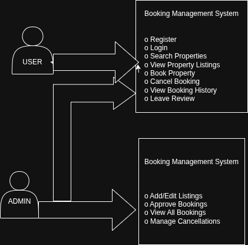

# Requirement Analysis in Software Development

## 📌 Introduction

This repository contains a comprehensive breakdown of **Requirement Analysis**—a foundational phase in the Software Development Lifecycle (SDLC). It documents the process of gathering, defining, and validating software requirements, with a focus on a **Booking Management System**. The purpose of this project is to simulate a real-world software analysis scenario and equip developers with practical experience in creating clear, structured requirement documentation that aligns with professional standards.

---

## 🧠 What is Requirement Analysis?

**Requirement Analysis** is a critical phase in the SDLC where stakeholders and developers work together to understand and define what the software system should do. It involves collecting requirements from stakeholders, analyzing them, documenting them in a structured format, and validating them to ensure they are clear, complete, and feasible.

This process ensures that the development team and stakeholders share a mutual understanding of the expected functionalities and constraints of the system.

---

## 🚀 Why is Requirement Analysis Important?

Requirement Analysis plays a pivotal role in software project success. Here are some key reasons:

- **Clarity and Understanding:** Ensures that stakeholders' needs are clearly understood, reducing confusion and miscommunication.
- **Scope Definition:** Helps define the project scope, preventing scope creep and unexpected feature requests later in the project.
- **Foundation for Design & Development:** Acts as the baseline for all subsequent phases of the project, including design, development, and testing.
- **Time and Cost Estimation:** Enables more accurate estimation of required resources, timelines, and budget.
- **Quality Assurance:** Ensures that the final product meets user expectations and business needs, resulting in higher satisfaction.

---

## 🧰 Key Activities in Requirement Analysis

The requirement analysis process typically includes the following five activities:

### 1. **Requirement Gathering** 🗂️
- Interviews with stakeholders
- Surveys and questionnaires
- Workshops
- Observation of user behavior
- Analysis of existing documents

### 2. **Requirement Elicitation** ✍️
- Brainstorming sessions
- Focus group discussions
- Prototyping to refine expectations

### 3. **Requirement Documentation** 📚
- Creating a Requirement Specification Document
- Writing User Stories and Use Cases

### 4. **Requirement Analysis and Modeling** 📊
- Prioritizing requirements by business value
- Performing feasibility studies
- Creating data flow diagrams and entity-relationship diagrams

### 5. **Requirement Validation** ✅
- Reviewing requirements with stakeholders
- Defining clear acceptance criteria
- Creating a requirements traceability matrix

---

## 🧱 Types of Requirements

### ⚙️ Functional Requirements

Functional requirements define what the system should do. For the **Booking Management System**, examples include:

- **User Registration:** Users can create an account with personal details and login credentials.
- **Login & Authentication:** Secure login with encrypted credentials.
- **Search Properties:** Users can search properties by location, date, price range, etc.
- **View Property Listings:** Display list of properties with images and essential details.
- **Make a Booking:** Users can book a property and receive confirmation.
- **Cancel or Update Booking:** Users can modify or cancel existing bookings.

### 🛡️ Non-functional Requirements

Non-functional requirements define how the system should behave. For the booking platform:

- **Performance:** The system should load any page in under 2 seconds.
- **Security:** Encrypt sensitive data and implement measures to prevent common attacks (e.g., XSS, CSRF).
- **Scalability:** The app should scale horizontally to support up to 1000 concurrent users.
- **Usability:** Simple and intuitive UI/UX with mobile responsiveness.
- **Reliability:** 99.9% uptime with minimal downtime for maintenance.

---

## 📊 Use Case Diagrams

**Use Case Diagrams** provide a visual overview of how users (actors) interact with the system. They help define system boundaries and user functionalities clearly.

### 🎯 Benefits:
- Clarifies system interactions
- Identifies user goals and required features
- Helps during both development and testing

### 🧾 Example: Booking System Use Case Diagram

Actors:
- Guest/User
- Admin

Use Cases:
- Register/Login
- Search Property
- View Listings
- Book Property
- Cancel Booking
- Manage Listings (Admin)
- Approve Booking (Admin)



> 📎 *Diagram created with Draw.io and saved as `alx-booking-uc.png`.*

---

## ✅ Acceptance Criteria

**Acceptance Criteria** are specific conditions that a software product must meet to be accepted by the client or end-user. They ensure each requirement is testable, measurable, and aligned with user expectations.

### 🧾 Importance:
- Clarifies what success looks like for each feature
- Provides a testing reference for QA
- Prevents misunderstandings between developers and clients

### 🧪 Example – Checkout Feature

> **Feature:** Book Property

**Acceptance Criteria:**
- User must be logged in to book a property
- Property availability is verified before confirmation
- Total price is calculated and displayed
- Payment process must be completed before booking is confirmed
- Booking confirmation email is sent to user after successful payment

---

## 📁 Repository Structure

```bash
requirement-analysis/
│
├── README.md
├── alx-booking-uc.png
